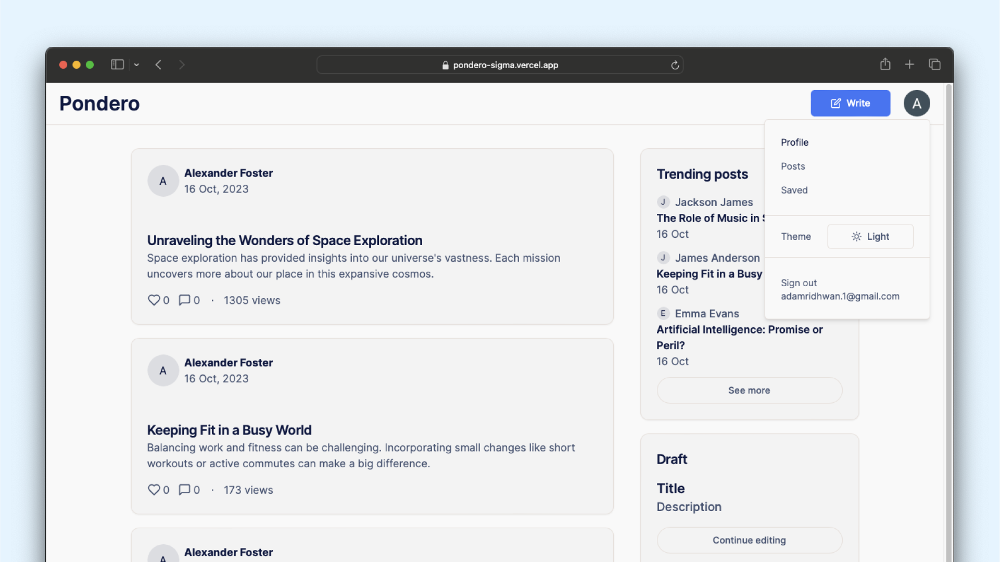

<br/>


<div align="center">
  <a href="https://github.com/adam-ridhwan/pixel-craft">
    
  </a>

  <h1>Pondero</h1>
  <h3>A blogging platform.</h3>
  <p>Note This Project Is Still W.I.P</p>

  <br/>
  <a href="https://pondero-sigma.vercel.app/">View Demo</a>

[//]: # (  .)

[//]: # (  <a href="https://docs.google.com/forms/d/e/1FAIpQLSdlGTqPyVnAYGZuC0pzYU1J4m9-B0ND2rJSooN6XKXdqQleug/viewform?usp=sf_link">Report Bug</a>)

[//]: # (  .)

[//]: # (  <a href="https://docs.google.com/forms/d/e/1FAIpQLSedrDUfoSsxrFd7_GMXyM-z_4qlYOX1ujV9x27EGr0T1qHCKw/viewform?usp=sf_link">Request Feature</a>)
</div>

<br/>
<br/>




## About The Project

### The Inspiration

Hey there! Let me take you on a little journey about why **Pondero** came to be. You know how the
online world i just overflowing with stories and ideas, right? Well, I wanted to create a space
that not only brings out all these diverse voices but also makes blogging fun and interesting. **Pondero**
is a dynamic and engaging blog social media app, inspired by the functionality and community-driven
aspects of platforms like [Medium](https://medium.com/) and [Hashnode](https://hashnode.com/). As a modern
web application, it is designed to provide a seamless and interactive blogging experience for both
readers and writers.

### The Technical Edge

Pondero uses a modern tech stack. Built with Next.js, React, and TypeScript, the app offers a solid,
scalable foundation. Tailwind CSS adds an aesthetic and responsive flair to the user interface, while
MongoDB ensures efficient data management. The integration of Zod aids in data validation, enhancing the
app's reliability.

### The Solution

I built this app as a testament to the power of learning and growth in the realm of fullstack development.
The process of building this app challenged my skills and pushed the boundaries of my technical knowledge.

### The Value

Through building this app, I have not only contributed to the world of digital story telling but also went
on a significant journey of self-improvement and learning. This app has equipped me with in-depth insights
into the process of building a blogging platform, and in doing so, has prepared me for future endeavors in
the world of web development.

## Built With

- Next.js
- React
- TypeScript
- Quill.js
- Zod
- MongoDB

## Usage

Below are some screenshots of how the app works.

### 1) Signin/Signout

Of course, to use the app, you must be signed in to use all of the features in the app, using
Google/GitHub/Facebook providers.

<br/>
<div align="center">

https://github.com/adam-ridhwan/pondero/assets/76563028/2a5278c6-f753-48fc-a008-14a7dda25b45

</div>
<br/>
<br/>

### 2) Navigating through different posts

Clicking on a post will send the user to the post page, which is rendered on the server. I also added a
loading skeleton in between navigation for better user experience. The loading skeleton gives the users an
indication that the posts is loading, while the data is being fetched from the database.

<br/>
<div align="center">

https://github.com/adam-ridhwan/pondero/assets/76563028/ff060236-305b-4a37-b9ea-ac673880d5c4

</div>
<br/>
<br/>

### 3) Infinite Scrolling

Infinite scrolling was my favorite feature to implement. It was actually quite difficult and I had a lot of
roadblocks. I almost wanted to quit trying to implement this feature but I could not get it to work
properly for a few days. However, I kept going and finally implemented this feature successfully with no
bugs!

<br/>
<div align="center">

https://github.com/adam-ridhwan/pondero/assets/76563028/5e9a4f2f-70cb-41c7-8f74-ad9f97ce3b1d

</div>
<br/>
<br/>

#### So how does it work?

1) Well, first I rendered the first 5 posts from the server and sent it over to the
   client

```typescript
const initialPosts = await getPosts(5, undefined);
```

<br/>

2) Then I attached a ref on to the last post (which is the 5th posts and is currently out of the
   viewport).

```typescript
const { ref, entry } = useIntersection({
  root: lastPostRef.current,
  threshold: 1,
}); 
```

<br/>

3) As soon as the user scrolls all the way down to the page and the last post is in the viewport,
   we then fetch the next 5 posts and render it on the client.

```typescript
const fetchInfinitePosts = useCallback(async () => {
  const lastId = posts?.at(-1)?._id?.toString();

  // Fetch next 5 posts from server
  const postsResponse = await fetch(
    `/api/posts?limit=${LIMIT}&id=${lastId}`, {
      signal,
      method: 'GET',
    });

  const fetchedPosts = await postsResponse.json();

//.....
}, [posts, authors, areAllPostsFetched]);
```

<br/>

4) Now we have 10 posts right? Remember we have the ref attached on to the 5th post, and we need to
   reattach the ref to the 10th post now, since it's the last one.

```typescript jsx
<div>
  {posts?.map((post, i) => {
    const lastPost = i === posts?.length - 1;
    return (
      <div key={post?._id?.toString()} ref={lastPost ? ref : null}>
        <PostItem />
      </div>
    );
  })}
</div>
```

<br/>

5) That's it! We just a useEffect, to check whenever the last post is in viewport, fetch the next posts,
   reattach the ref to the new last post, the cycle repeats until we get to the end of the post.

```typescript
useEffect(() => {
  if (entry?.isIntersecting && !areAllPostsFetched) {
    (async () => await fetchInfinitePosts())();
  }
}, [areAllPostsFetched, entry]);
```

<br/>

### 4) Write a blog

Users have the ability to write a blog. I used quill.js as the text editor to allow seamless text editing.
Users are also able to paste a text if they want to. Once the user has finished writing, they also have
the option to upload to the public homepage.

The text styles are as follows: -

1) Heading
2) Subheading
3) Paragraph
4) Italics
5) Underline
6) Strikethrough
7) Quote
8) Number tag
9) Bullet tag
10) Padding
11) Codeblocks

<br/>
<div align="center">

https://github.com/adam-ridhwan/pondero/assets/76563028/7c06d4ae-aed1-47a4-9d19-20725dd97fb9

</div>
<br/>
<br/>

### 5) Like, Comment, Save, Share posts

Users have the ability to like a post, comment on a post, save a post and share posts using a link. These
are all CRUD operations that persists the values and information in the database.

<br/>
<div align="center">

https://github.com/adam-ridhwan/pondero/assets/76563028/7ea87393-05ba-4700-8b18-8f2d9f96e595

</div>
<br/>
<br/>


### 6) Sticky sidebar

This is also another feature that loved creating. Basically the way it works is the sidebar will always
stick to the side. Also, take note that the side bar is also bigger than the viewport, so making this
sticky was kind of tricky.

When user is scrolling down on the homepage, the sidebar also scroll down along
with the homepage until it reaches to the bottom, then it will stick. Will work the opposite way when
scrolling up. This will make it so that the user will always have access to the sidebar if they want to
navigate to trending posts, see other users, etc.

<br/>
<div align="center">

https://github.com/adam-ridhwan/pondero/assets/76563028/44a1da7a-fb91-4fda-bf44-36108dcde04c

</div>
<br/>
<br/>


## Roadmap

I still have a lot to do on this project, so here is a list of what I am going to do: -

- [x] ~~Create posts page~~
- [x] ~~Create individual post page~~
- [x] ~~Create writing page~~
- [x] ~~Authentication using NextAuth with Google, GitHub, Facebook providers~~
- [x] ~~Allow users to post a blog to home page~~
- [x] ~~Implement sticky sidebar~~
- [ ] Fix slight jump of sidebar when scrolling up
- [ ] Allow users to upload profile picture or just profile picture from providers.
- [ ] Allow image uploads as thumbnail
- [ ] Allow users to like a comment
- [ ] Allow users to delete a post
- [ ] Allow users to delete a comment

## Getting Started

To get started, you need to get your own api keys from mongodb, openai, nextauth, cloudinary and google.

### Installation

1. Get a free API Key at mongodb, openai, nextauth, cloudinary and google

2. Clone the repo

```sh
git clone https://github.com/adam-ridhwan/pondero.git
```

3. Install NPM packages

```sh
npm install
```

4. Enter your API in `.env`

```env
API_KEY = 'ENTER YOUR API';
```

## Contributing

Contributions are what make the open source community such an amazing place to be learn, inspire, and create.
Any contributions you make are **greatly appreciated**.

* If you have suggestions for adding or removing features, feel free to contact me to discuss it, or
  directly create a pull request after you edit the *README.md* file with necessary changes.
* Please make sure you check your spelling and grammar.
* Create individual PR for each suggestion.

### Creating A Pull Request

1. Fork the Project
2. Create your Feature Branch (`git checkout -b feature/AmazingFeature`)
3. Commit your Changes (`git commit -m 'Add some AmazingFeature'`)
4. Push to the Branch (`git push origin feature/AmazingFeature`)
5. Open a Pull Request

## Authors

* **Adam Ridhwan** - *Fullstack Engineer* - [Adam Ridhwan](https://github.com/adam-ridhwan) - *Creator of
  PixelCraft*
